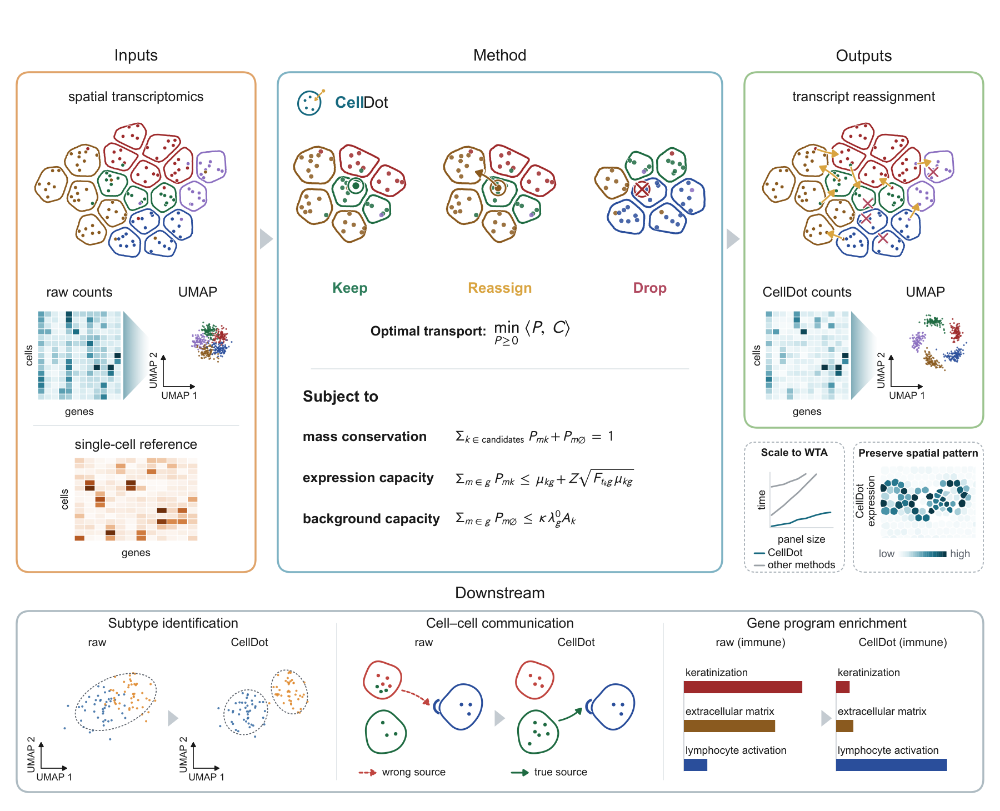
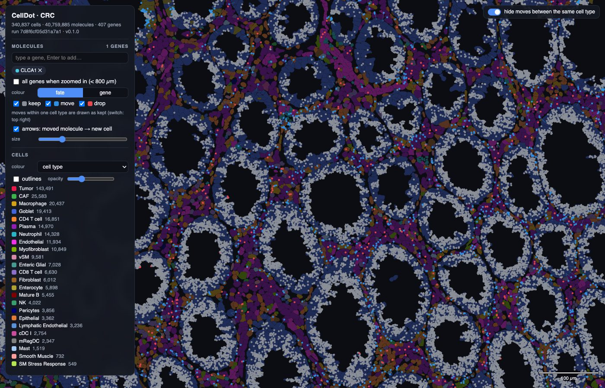

<p align="center"></p>

<p align="center">Molecule-level decontamination for imaging-based spatial transcriptomics.</p>

<p align="center"><a href="https://viewer.celldot.online">Live demo</a> · <a href="#install">Install</a> · <a href="#run-celldot-in-three-steps">Run</a> · <a href="#outputs">Outputs</a> · <a href="#the-viewer">Viewer</a></p>

<p align="center">
<a href="https://github.com/YangLabHKUST/CellDot/stargazers"></a>
<a href="LICENSE"></a>
<a href="https://doi.org/10.5281/zenodo.22489061"></a>
<a href="https://viewer.celldot.online"></a>
</p>

---

Segmentation errors and spillover put many detected molecules in the wrong cell. CellDot decides, for every
molecule of a section, whether it stays in its cell, moves to a neighbouring cell, or is removed as background,
by solving one optimal-transport problem guided by a single-cell reference. The output is a corrected cell × gene
matrix and the fate of each molecule.

<p align="center"></p>

## Install

```bash
git clone https://github.com/YangLabHKUST/CellDot.git
cd CellDot
pip install -e ".[viewer,annotate]"
```

Python ≥ 3.10. A CUDA GPU is used when present; the CPU gives the same result, more slowly.

## Run CellDot in three steps

**1. Cell types for the spatial cells.** CellDot needs a label for each cell in the reference's vocabulary. If you
do not have one yet, `celldot-annotate` transfers the reference labels with scANVI (the recipe used in the paper);
any other annotation works too (marker scoring, cell2location, Tangram, …) as long as it yields a table with
`cell_id` and `celltype`.

```bash
celldot-annotate --input outs/ --reference reference.h5ad --output labels.parquet
```

**2. Clean.**

```bash
celldot --input outs/ --reference reference.h5ad --labels labels.parquet --output celldot/
```

**3. Look at the result.**

```bash
celldot-view --run celldot/ --boundaries outs/cell_boundaries.parquet      # opens http://127.0.0.1:8765
```

`outs/` is the folder your platform exported (for Xenium, the `outs` folder with `transcripts.parquet`,
`cells.parquet`, `cell_feature_matrix.h5` and `cell_boundaries.parquet`). The breast cancer section of the paper
(168 k cells, 31 M molecules) takes about five minutes on one GPU.

## Inputs

- `--input`: the platform's output folder with `transcripts.parquet`, `cells.parquet` and `cell_feature_matrix.h5`.
- `--reference`: a single-cell reference of the same tissue (`.h5ad`): raw counts in `X` or `layers["counts"]`, the cell type in
  `obs["celltype"]`. Other names: `--ref-counts-layer`, `--ref-label-col`.
- `--labels`: the spatial cells' types, a parquet with `cell_id` and `celltype` (step 1) using the reference's cell-type names.

## Outputs

Two files in `--output`, and nothing else you need to read:

| | |
|:--|:--|
| `cleaned.h5ad` | the cells. `X` is the corrected count matrix, `layers["raw"]` the counts before, `obs["type"]` the cell type; `obs_names` are the original cell ids. |
| `transcripts.parquet` | the molecules: your input table, row for row and every column unchanged, plus `celldot_fate` (`keep` / `move` / `drop`) and `celldot_cell_id` (the cell the molecule belongs to now). |

```python
import anndata as ad, pandas as pd
A = ad.read_h5ad("celldot/cleaned.h5ad")          # A.X corrected, A.layers["raw"] before
t = pd.read_parquet("celldot/transcripts.parquet")
t.celldot_fate.value_counts()                     # keep / move / drop (+ background, not_evaluated: untouched rows)
```

Molecules that were extracellular in the input (`background`) or not evaluated (low quality, gene outside the
panel, unlabelled cell) keep their original assignment.

## The viewer

<p align="center"><a href="https://viewer.celldot.online/d/CRC/"></a></p>

An interactive map of the section in your browser: cells coloured by type or by the expression of a gene before
and after correction, the molecules of the genes you pick coloured by fate (grey kept, blue moved with an arrow to
the new cell, red dropped), and a click on any cell lists all of its molecules. Try it on the paper's datasets at
**[viewer.celldot.online](https://viewer.celldot.online)**.

To open it on your own result, point it at the CellDot output folder and the platform's cell boundaries:

```bash
celldot-view --run celldot/ --boundaries outs/cell_boundaries.parquet
```

The command builds a query index next to the result the first time (about a minute per hundred million
molecules), starts a local server and opens http://127.0.0.1:8765 in your browser; later launches are instant.
On a remote machine add `--no-browser` and forward the port with ssh.

## Python

```python
from celldot import CellDotConfig, clean
A = clean(CellDotConfig(input="outs/", reference="reference.h5ad", labels="labels.parquet", output="celldot/"))
```

`celldot --help` lists the advanced parameters; they were left at their defaults for every dataset in the paper.

## Reproducing the paper

All the code and data needed to reproduce the main figures of the paper are in one Zenodo record,
[10.5281/zenodo.22489061](https://doi.org/10.5281/zenodo.22489061): `repro.zip` holds one script per panel with the
paper's own plotting style and the analysis scripts behind each panel, and `repro_data.zip` holds the data every
script reads, including the CellDot runs of the four sections (the corrected cell × gene matrices, the fate of every
molecule and the references).

## Citation

Chen Y., Liu Y., et al. *Accurate and scalable decontamination of imaging-based spatial transcriptomics via optimal
transport.* (manuscript in preparation)
